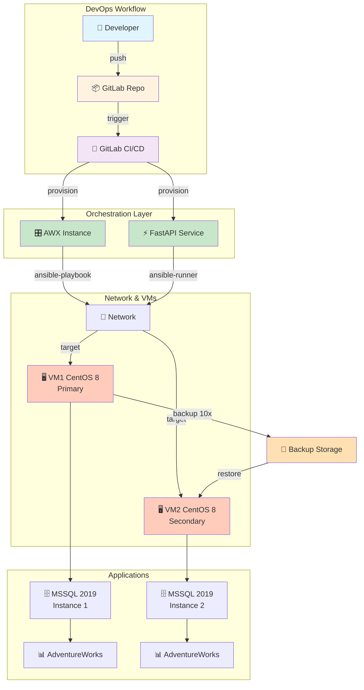
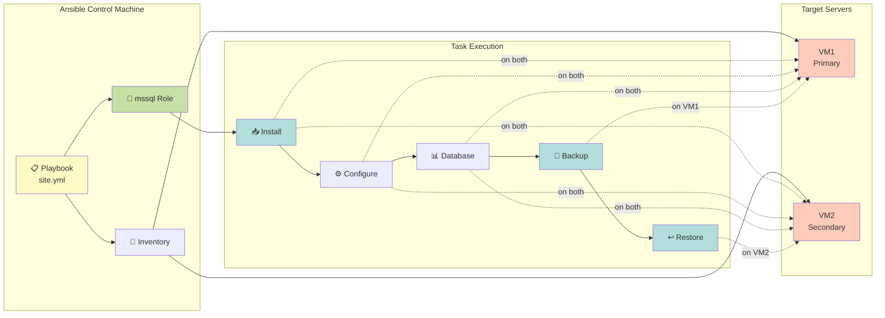
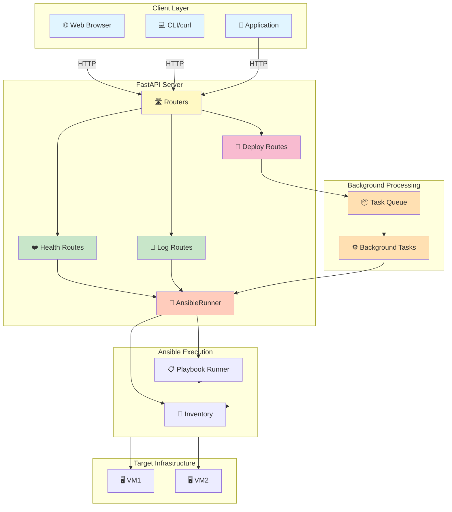
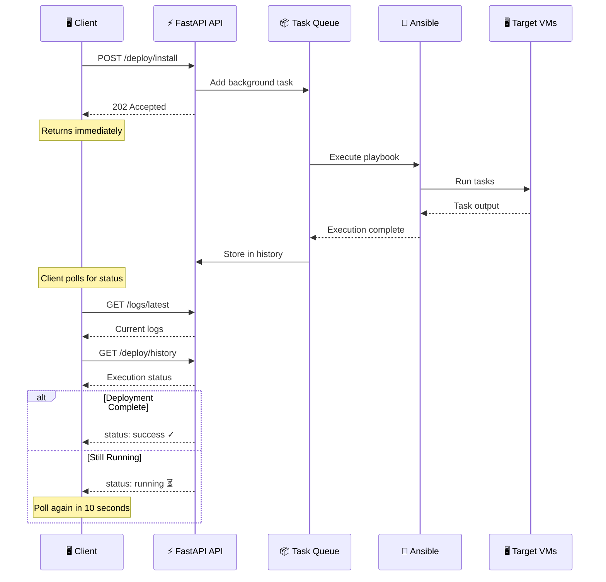
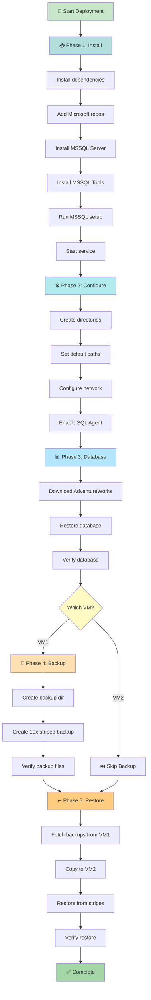
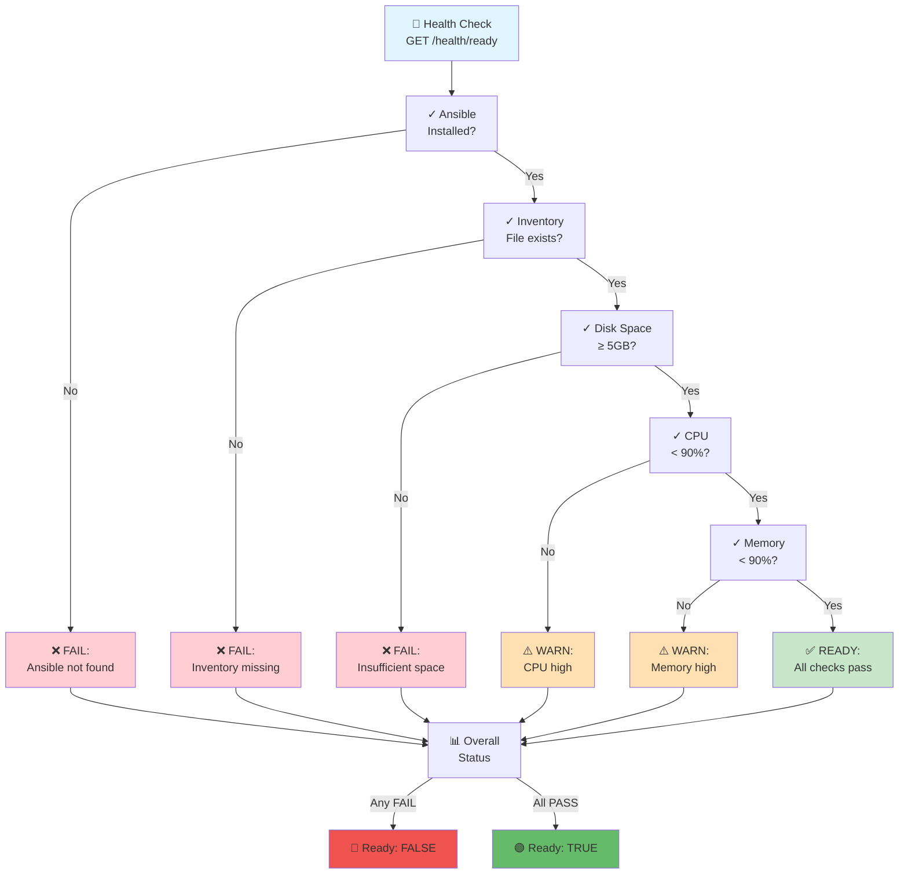
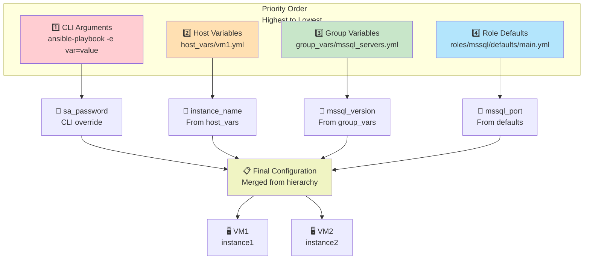
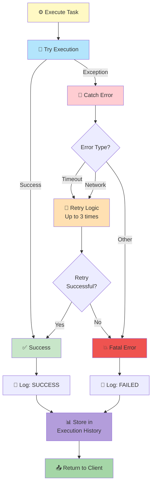
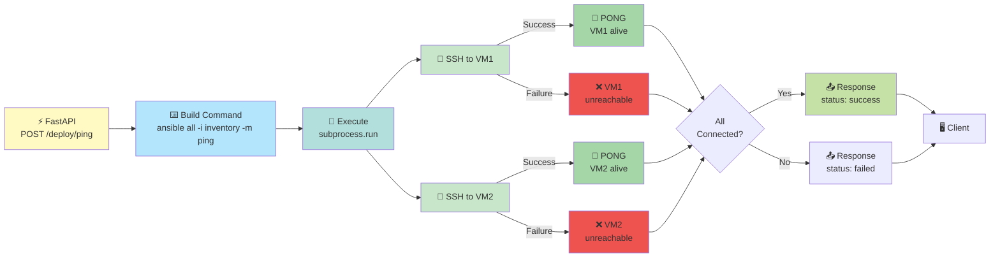

# Architecture Diagrams

## 1. Overall System Architecture

## 2. Ansible Deployment Architecture

## 3. FastAPI Deployment Service Architecture

## 4. Backup and Restore Data Flow

```mermaid
graph LR
    subgraph VM1Backup["VM1: Backup Creation"]
        DB1["🗄️ AdventureWorks<br/>Database"]
        Backup["💾 10x Striped Backup<br/>adv_stripe_01-10.bak"]
        Dir1["📁 /backup/striped/"]
    end
    
    subgraph Transfer["Transfer Layer"]
        Fetch["📥 Fetch<br/>ansible module"]
        Local["💻 Control Machine<br/>./backups/vm1_striped/"]
        Copy["📤 Copy<br/>ansible module"]
    end
    
    subgraph VM2Restore["VM2: Restore Operation"]
        Dir2["📁 /backup/striped/"]
        Restore["↩️ RESTORE DATABASE<br/>from 10x striped"]
        DB2["🗄️ AdventureWorks<br/>Database"]
    end
    
    DB1 -->|BACKUP to| Backup
    Backup --> Dir1
    Dir1 -->|fetch| Fetch
    Fetch --> Local
    Local -->|copy| Copy
    Copy --> Dir2
    Dir2 -->|RESTORE from| Restore
    Restore --> DB2
    
    style DB1 fill:#c8e6c9
    style Backup fill:#ffe0b2
    style Fetch fill:#81c784
    style Local fill:#ffb74d
    style Copy fill:#81c784
    style Restore fill:#81c784
    style DB2 fill:#c8e6c9
```

## 5. Request/Response Flow - API Call

## 6. Deployment Task Execution Sequence

## 7. Health Check Flow

## 8. Configuration Management Hierarchy

## 9. Error Handling Flow

## 10. VM Connectivity Verification

