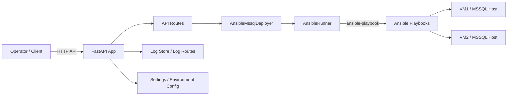
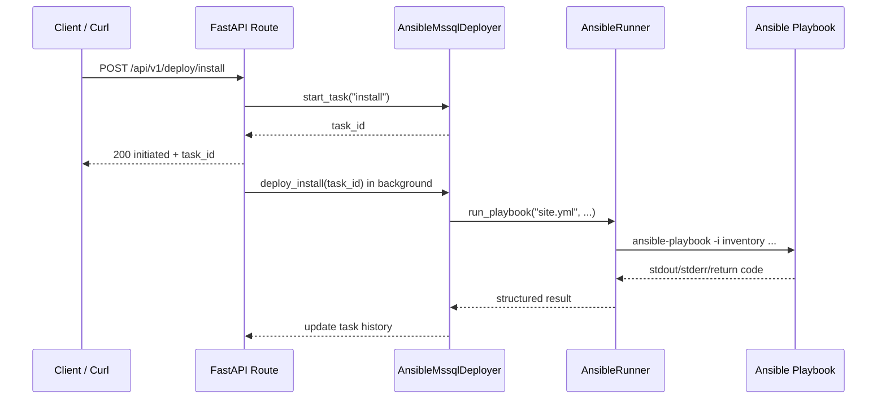
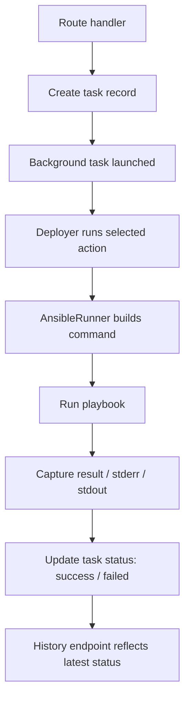
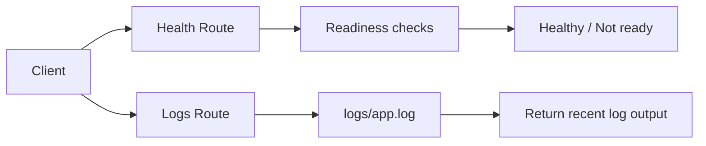

# MSSQL FastAPI + Ansible Lab — Implementation Handoff

Date: 2026-07-25

Repository: /home/devops/devops/my-devops-project

Project folder: /home/devops/devops/my-devops-project/python-fastapi-mssql

This document captures the work completed so far, the current state of the project, the overall system design, the code flow, and the exact steps to continue from this point without losing context.

---

## 1. Overall System Design Architecture

The project is a FastAPI-based control plane for orchestrating MSSQL deployment workflows against VMware lab VMs using Ansible playbooks.

### High-level architecture



### Runtime responsibilities

- FastAPI exposes deployment, health, and logging endpoints.
- The deployer creates task records and tracks task state in memory.
- The Ansible runner launches playbooks such as install, backup/restore, and Always On workflows.
- The playbooks execute against VM1 and VM2 in the lab environment.
- Logs and deployment history are surfaced through REST endpoints.

### Core components

- API entrypoint: [python-fastapi-mssql/app/main.py](python-fastapi-mssql/app/main.py)
- Deployment orchestration: [python-fastapi-mssql/app/deployer.py](python-fastapi-mssql/app/deployer.py)
- Ansible execution wrapper: [python-fastapi-mssql/app/ansible_runner.py](python-fastapi-mssql/app/ansible_runner.py)
- Deployment routes: [python-fastapi-mssql/app/routes/deploy.py](python-fastapi-mssql/app/routes/deploy.py)
- Health/logging routes: [python-fastapi-mssql/app/routes/health.py](python-fastapi-mssql/app/routes/health.py) and [python-fastapi-mssql/app/routes/logs.py](python-fastapi-mssql/app/routes/logs.py)
- Tests: [python-fastapi-mssql/tests/test_api.py](python-fastapi-mssql/tests/test_api.py)

---

## 2. How We Got Here

### Initial review

The session started by reviewing the repository and the existing handoff note in [SESSION_HANDOFF.md](SESSION_HANDOFF.md). The project structure showed a combined DevOps lab with:

- Ansible MSSQL deployment assets
- A FastAPI service for orchestrating deployment tasks
- VMware/AWX-related documentation
- A local Python FastAPI testable app under [python-fastapi-mssql](python-fastapi-mssql)

### What was inspected

- The FastAPI service entrypoint and route definitions
- The Ansible runner and deployment orchestrator
- The health and logging routes
- The existing tests and current environment state

### What was discovered

The FastAPI app was already implemented at a high level, but the local test runner had a package import issue when invoking pytest directly. The root cause was that pytest was not resolving the project root as a Python import path in this environment.

### Fix applied

A pytest configuration file was added at [python-fastapi-mssql/pytest.ini](python-fastapi-mssql/pytest.ini) to ensure the local project root is on the Python path during test discovery.

### Verification performed

The test suite was verified with:

```bash
cd /home/devops/devops/my-devops-project/python-fastapi-mssql
/home/devops/devops/my-devops-project/python-fastapi-mssql/.venv/bin/python -m pytest -q
```

Result:

- 5 tests passed

---

## 3. Current Project State

### Working state

- The FastAPI app structure is present and wired to deployment routes.
- The deployment API supports:
  - install
  - backup/restore
  - install tools only
  - restore AdventureWorks only
  - Always On workflow
  - status/history
  - host pinging
- The project is ready for local launch and API interaction.

### Important files

- [python-fastapi-mssql/app/main.py](python-fastapi-mssql/app/main.py)
- [python-fastapi-mssql/app/deployer.py](python-fastapi-mssql/app/deployer.py)
- [python-fastapi-mssql/app/ansible_runner.py](python-fastapi-mssql/app/ansible_runner.py)
- [python-fastapi-mssql/app/routes/deploy.py](python-fastapi-mssql/app/routes/deploy.py)
- [python-fastapi-mssql/pytest.ini](python-fastapi-mssql/pytest.ini)

### Current environment assumptions

The service expects:

- A working Python virtual environment under [python-fastapi-mssql/.venv](python-fastapi-mssql/.venv)
- An environment file at [python-fastapi-mssql/.env](python-fastapi-mssql/.env) if present
- Valid SSH/VM settings for the lab hosts
- Ansible inventory and playbook paths configured correctly

---

## 4. Code Flow Diagrams

### A. Request lifecycle for a deployment action



### B. Internal component flow



### C. Health and logging flow



---

## 5. Repository Layout Relevant to This Work

```text
python-fastapi-mssql/
  app/
    main.py
    deployer.py
    ansible_runner.py
    routes/
      deploy.py
      health.py
      logs.py
  ansible/
    inventory/
    playbooks/
    roles/
  tests/
    test_api.py
  requirements.txt
  pytest.ini
  .env.example
  README.md
  RUNBOOK.md
```

---

## 6. Commands to Resume the Work

### Enter the project directory

```bash
cd /home/devops/devops/my-devops-project/python-fastapi-mssql
```

### Activate the virtual environment

```bash
source .venv/bin/activate
```

### Verify tests

```bash
python -m pytest -q
```

### Create or review the environment file

```bash
cp .env.example .env
```

Then verify the key values in [.env](python-fastapi-mssql/.env) if it exists.

### Start the API

```bash
uvicorn app.main:app --reload --host 0.0.0.0 --port 8000
```

### Verify health

```bash
curl http://localhost:8000/api/v1/health/check
```

### Example deployment actions

Install MSSQL:

```bash
curl -X POST http://localhost:8000/api/v1/deploy/install
```

Check status:

```bash
curl http://localhost:8000/api/v1/deploy/status
```

View history:

```bash
curl http://localhost:8000/api/v1/deploy/history
```

Ping hosts:

```bash
curl -X POST http://localhost:8000/api/v1/deploy/ping
```

Backup / restore:

```bash
curl -X POST http://localhost:8000/api/v1/deploy/backup
```

Always On:

```bash
curl -X POST http://localhost:8000/api/v1/deploy/alwayson
```

---

## 7. What to Expect Next

The next practical step is to launch the FastAPI service and exercise the deployment endpoints against the lab environment.

At that point, the expected flow is:

1. Start the API.
2. Confirm health and connectivity.
3. Trigger an install or backup workflow.
4. Poll status/history until the task completes.
5. Inspect logs if there are failures.

---

## 8. Notes and Caveats

- This service is designed for a lab environment and depends on SSH reachability and inventory correctness.
- Long-running operations are handled asynchronously and reported through task history.
- The deployment state is currently in-memory, not persisted to a database.
- The service uses Ansible playbooks under [python-fastapi-mssql/ansible](python-fastapi-mssql/ansible).

---

## 9. Recommended Next Read

If you want to continue from this point, the best order is:

1. Review this file.
2. Confirm the environment file values.
3. Start the FastAPI service.
4. Exercise one deployment endpoint.
5. Use the status/history/log routes to inspect progress.
