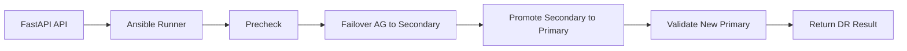

# MSSQL DR Failover Design

## Purpose

This design adds a disaster-recovery failover workflow for the current MSSQL lab so a FastAPI control plane can trigger a controlled move from the primary VM to the secondary VM and make the secondary the new primary.

The flow is intended for learning, testing, and future automation around Always On Availability Groups.

---

## Goal

Enable a simple end-to-end DR path where:
- the current primary is assessed
- the secondary is promoted
- the AG role is reversed
- the application path is updated to the new primary
- the state is validated before the workflow exits

---

## Proposed FastAPI orchestration

The FastAPI service can expose:
- POST /api/v1/dr/failover/mssql
- GET /api/v1/dr/status/mssql
- POST /api/v1/dr/failback/mssql

The implementation should call Ansible playbooks through the existing Ansible runner layer so the orchestration stays consistent with the current architecture.

---

## Suggested workflow

1. Precheck
   - verify both VMs are reachable
   - confirm AG health
   - confirm database state and synchronization status

2. Failover execution
   - stop client traffic or switch to maintenance mode
   - perform the AG failover to the secondary
   - promote the secondary to primary
   - update listener or endpoint configuration

3. Postcheck
   - verify the new primary role
   - confirm AG health and synchronization state
   - record results in logs and history

---

## Simple flow diagram

---

## Ansible playbook phases

### 1. Precheck phase
- check host reachability
- check AG health
- check database synchronization

### 2. Failover phase
- run the AG failover action
- update the AG role state
- reconfigure listener or application endpoint references

### 3. Validation phase
- verify the new primary role
- confirm health and replication state
- create a clear success or failure record

---

## Reverse role design

After the failover, the old primary can be reintroduced as a secondary role and rejoined to the AG.

This makes the environment suitable for:
- failover testing
- recovery experiments
- re-failback drills
- learning how AG role reversal works in practice

---

## Learning value

This design teaches:
- AG failover mechanics
- role reversal behavior
- how to automate DR steps from a control plane
- how to make DR operations repeatable and observable
