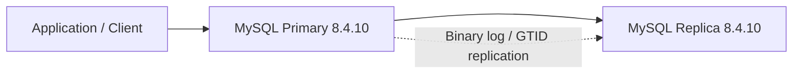

# MySQL 8.4.10 Community Edition Replication Design

## Purpose

This document outlines a new lab design for MySQL Community Edition 8.4.10 using Percona XtraBackup to initialize a standby server and replication to keep it in sync.

The design is intended for learning, experimentation, and later engineering work.

---

## High-level goal

Build a simple MySQL replication topology with:
- one primary MySQL server
- one standby replica server
- XtraBackup for initial backup and restore
- GTID-based replication
- a clear teardown and rewind path

---

## Proposed topology

---

## Core components

- MySQL Community Edition 8.4.10
- Percona XtraBackup
- GTID enabled
- Binary logging enabled
- Replication user configured
- Standby server initialized from backup

---

## Build sequence

1. Install MySQL 8.4.10 on primary and replica hosts
2. Configure server IDs and replication settings
3. Enable binlog and GTID on the primary
4. Create a replication user on the primary
5. Take an XtraBackup snapshot of the primary
6. Prepare and restore the backup on the replica
7. Configure the replica to connect to the primary
8. Start replica and verify replication status

---

## Why XtraBackup

XtraBackup is useful because it provides a fast and consistent way to initialize the replica from a live primary without stopping the service for long periods.

This makes it a strong fit for a lab environment where the goal is to learn replication mechanics quickly.

---

## Suggested automation split

### Provisioning phase
- install MySQL packages
- create directories and ownership
- configure service settings

### Backup and sync phase
- enable binlog and GTID
- create replication account
- run XtraBackup on the primary
- restore the backup on the replica

### Replication phase
- configure CHANGE MASTER TO settings
- start replica threads
- validate replication health

---

## Reverse and teardown flow

The lab should also support rollback by:
- stopping replication on the replica
- removing replication metadata
- dropping the replication user
- removing copied backup data and configuration files
- optional package removal if the environment is being fully reset

---

## Learning outcomes

This design teaches:
- MySQL replication concepts
- GTID-based replication
- backup restore using XtraBackup
- standby initialization and failover preparation
- how to build, verify, and rewind a replication-based lab
