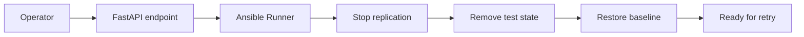

# MySQL Rewind and Teardown Design

## Purpose

This document defines a reverse-path design for the MySQL 8.4.10 lab so the environment can be reset, rolled back, or torn down safely after testing.

The goal is to make MySQL replication and backup experiments repeatable and easy to rewind for learning and troubleshooting.

---

## High-level goal

Support a simple lifecycle for the MySQL lab:
- build the primary and replica environment
- run replication or backup experiments
- rewind the environment to a clean baseline
- tear down the lab when needed

---

## Proposed reverse workflow

1. Stop replication and application traffic if needed
2. Stop MySQL services on the affected hosts
3. Remove replication metadata and temporary objects
4. Delete backup or recovery artifacts created during the experiment
5. Return the hosts to a known baseline state

---

## Suggested FastAPI actions

The FastAPI control plane can expose:
- POST /api/v1/rewind/mysql
- POST /api/v1/teardown/mysql
- GET /api/v1/rewind-plan/mysql

These endpoints can drive Ansible playbooks through the existing runner layer.

---

## Simple flow diagram

---

## Suggested playbook phases

### 1. Prepare phase
- confirm replication state and current roles
- capture the current environment context for logging

### 2. Reverse phase
- stop replica threads or replication services
- remove replication users or metadata if required
- clear temporary backup or test data

### 3. Baseline phase
- restore the host to a known lab baseline
- leave the environment ready for another build run

---

## Learning value

This design helps teach:
- how to safely undo MySQL lab changes
- how to isolate experimental state from the base environment
- how to practice recovery and rollback operations without permanent damage to the lab
