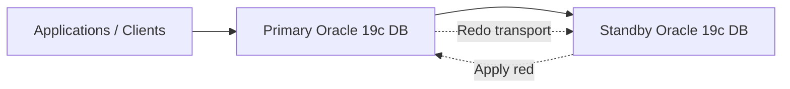

# Oracle 19c Data Guard Lab Design

## Purpose

This document outlines a new lab design for Oracle 19c using a primary and standby database with Data Guard for high availability and failover learning.

The design is intended for experimentation, architecture understanding, and future engineering work.

---

## High-level goal

Build a simple Oracle 19c stack with:
- one primary database
- one standby database
- redo transport between them
- Data Guard broker-based monitoring
- a clear reverse path for teardown and retry

---

## Proposed topology

---

## Core components

- Oracle Linux hosts
- Oracle 19c software installation
- Primary database instance
- Standby database instance
- Listener and tnsnames configuration
- ARCHIVELOG mode enabled
- Force logging enabled
- Data Guard broker enabled

---

## Build sequence

1. Prepare hosts and storage
2. Install Oracle 19c software
3. Create the primary database
4. Enable archivelog and force logging
5. Configure listener and network services
6. Create the standby database from the primary
7. Configure redo transport and apply services
8. Enable Data Guard broker
9. Validate switchover and failover readiness

---

## Key design choices

- Use a simple two-node lab topology for clarity
- Keep the standby in a separate host and storage path
- Use Data Guard broker for easier monitoring and future automation
- Keep the process idempotent so it can be repeated safely

---

## Suggested automation split

### Provisioning phase
- host prep
- user and group configuration
- Oracle software install
- database creation

### Data Guard phase
- enable archive log mode
- configure standby redo log files
- create standby controlfile
- configure DG Broker
- start transport and apply services

### Validation phase
- verify primary/standby state
- confirm redo apply status
- test switchover and failover readiness

---

## Reverse and teardown flow

The same lab should support rollback by:
- stopping redo transport
- disabling the broker
- stopping listener services
- removing standby configuration
- dropping the standby database
- resetting the hosts to a clean state

---

## Learning outcomes

This design is meant to teach:
- Oracle installation fundamentals
- Data Guard principles
- redo transport and apply processes
- broker-based failover behavior
- how to build, test, and rewind a complex HA stack
