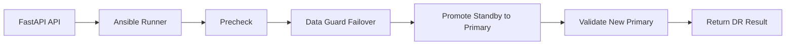

# Oracle 19c Data Guard Failover Design

## Purpose

This design adds a disaster-recovery failover workflow for Oracle 19c so the FastAPI control plane can trigger a controlled role switch from the primary database to the standby database and make the standby the new primary.

The goal is to create a simple, testable Data Guard failover path for lab use.

---

## Goal

Enable an automated DR path where:
- the primary health is verified
- the standby is assessed for readiness
- the role is switched to the standby
- the standby becomes the new primary
- the environment is validated after the change

---

## Proposed FastAPI orchestration

The FastAPI service can expose:
- POST /api/v1/dr/failover/oracle
- GET /api/v1/dr/status/oracle
- POST /api/v1/dr/failback/oracle

The implementation should call Ansible playbooks through the Ansible runner so the logic is consistent with the rest of the lab environment.

---

## Suggested workflow

1. Precheck
   - verify host connectivity
   - verify listener and broker status
   - verify redo apply health and gap status

2. Failover execution
   - stop or redirect application traffic
   - run the Data Guard failover action through the broker
   - promote the standby to primary
   - update connection settings and service mapping

3. Postcheck
   - verify the new primary role
   - confirm redo transport and apply health
   - record the outcome in the logs

---

## Simple flow diagram

---

## Ansible playbook phases

### 1. Precheck phase
- confirm broker status
- ensure standby is ready
- verify redo apply lag

### 2. Failover phase
- execute the broker failover operation
- update TNS and listener references
- update any application-facing service names if needed

### 3. Validation phase
- confirm the new primary is active
- check the standby role of the old primary
- record the failover result

---

## Reverse role design

After the failover, the old primary can be rebuilt or restarted as a standby and re-synchronized with the new primary.

This supports:
- failover rehearsals
- recovery drills
- Data Guard role reversal testing
- deeper understanding of Oracle HA behavior

---

## Learning value

This design teaches:
- Oracle Data Guard failover behavior
- broker-based role changes
- redo transport and apply concepts
- how automation can simplify DR execution
