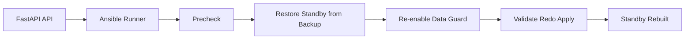

# Oracle 19c Data Guard Sync Rebuild Design

## Purpose

This design covers the recovery path when an Oracle Data Guard standby has fallen out of sync or needs to be rebuilt after a role change or outage.

The purpose is to create a repeatable workflow for re-establishing a healthy standby database.

---

## Goal

Provide a rebuild path where:
- the primary is validated
- the standby is reinitialized from the latest available backup
- Data Guard is re-established
- redo apply resumes normally
- the environment is verified again

---

## Proposed FastAPI orchestration

The FastAPI service can expose:
- POST /api/v1/dr/sync-rebuild/oracle
- GET /api/v1/dr/sync-status/oracle

The workflow should use Ansible playbooks through the existing runner interface.

---

## Suggested workflow

1. Precheck
   - verify the primary is running
   - confirm backup availability and storage capacity
   - identify the standby drift or outage condition

2. Rebuild execution
   - create or restore the standby from the latest backup
   - reconfigure the standby database and broker settings
   - re-enable redo transport and apply services

3. Validation
   - verify broker health
   - confirm redo apply is active
   - record the rebuild status

---

## Simple flow diagram

---

## Ansible playbook phases

### 1. Prepare phase
- verify storage and listener configuration
- confirm the backup source and database state

### 2. Rebuild phase
- perform standby creation or duplicate operation
- restore broker parameters and network settings

### 3. Validation phase
- check broker status and redo apply health
- log the rebuild success or failure

---

## Learning value

This design teaches:
- standby rebuild mechanics
- Data Guard recovery steps
- how to automate recovery for lab investigations
- how to restore the DR posture after a failure
