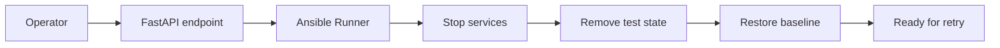

# Oracle Rewind and Teardown Design

## Purpose

This document defines a reverse-path design for the Oracle 19c lab so the environment can be reset, rolled back, or torn down safely after testing.

The goal is to make Oracle experiments repeatable and easy to rewind for learning, troubleshooting, and future DR work.

---

## High-level goal

Support a simple lifecycle for the Oracle lab:
- build the primary and standby environment
- run Data Guard or failover experiments
- rewind the environment to a clean baseline
- tear down the lab when needed

---

## Proposed reverse workflow

1. Stop application traffic or place the environment in maintenance mode
2. Stop Oracle services and listeners
3. Disable Data Guard broker or replication-related services
4. Remove temporary database objects or test schemas
5. Drop or reset standby-related state
6. Return the hosts to a known baseline state

---

## Suggested FastAPI actions

The FastAPI control plane can expose:
- POST /api/v1/rewind/oracle
- POST /api/v1/teardown/oracle
- GET /api/v1/rewind-plan/oracle

These endpoints can drive Ansible playbooks through the existing runner layer.

---

## Simple flow diagram

---

## Suggested playbook phases

### 1. Prepare phase
- confirm current role and service state
- capture environment context for logging

### 2. Reverse phase
- stop the listener and database services
- disable broker or transport settings
- remove temporary standby state

### 3. Baseline phase
- restore host state to a lab baseline
- leave the environment ready for another build run

---

## Learning value

This design helps teach:
- how to safely undo Oracle lab changes
- how to isolate experimental state from the base environment
- how to practice recovery and rollback operations without permanent damage to the lab
